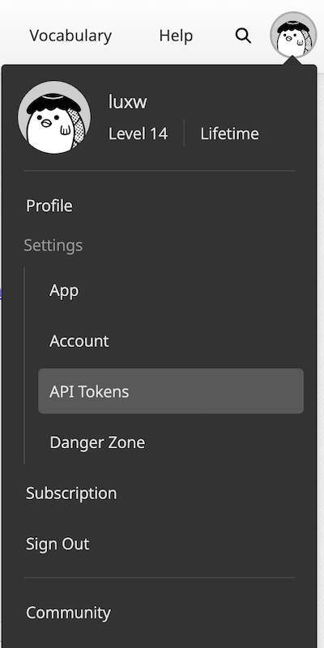
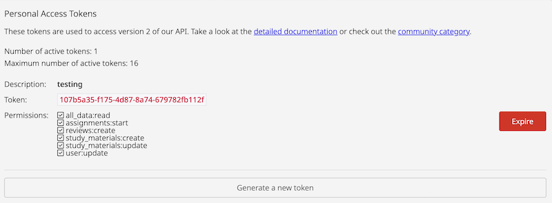

# Droid WaniKani

This app is a Android interpretation of the [WaniKani](http://www.wanikani.com) webapp. 

#### Disclaimer
This application is an unofficial, open-source project and is not affiliated with, endorsed, or sponsored by Tofugu LLC or its service, WaniKani. WaniKani is a paid service owned and operated by Tofugu LLC, and all rights to the WaniKani name, logo, and content belong to Tofugu LLC.

This application utilizes the WaniKani API to access and display content for users. Users of this application are solely responsible for their own WaniKani accounts, including any subscription fees and adherence to WaniKani's Terms of Service and API guidelines. The developers of this application make no guarantees regarding the accuracy, completeness, or reliability of the data presented, and are not liable for any issues or damages that may arise from its use.

Please contact Tofugu LLC for any questions regarding WaniKani's official service and policies.

### What is WaniKani?

WaniKani is a platform for studying the Japanese language, more specifically to study Kanji by
leveraging SRS (spaced repetition system) and mnemonics.

### What is the purpose of this app?

WaniKani doesn't have a native Android application, instead what they offer is a Progressive
Web App, which is nothing more than a shortcut to their web app, but without the "browser" aspects.

There are some other apps, but they're either old or done in React Native, so I wanted to create
a native Android app. 

Possibly, we will be migrating to Kotlin Multiplatform in the future to also target iOS.

### How to obtain an API key

1. Log in to your WaniKani account in their web app. 
2. Click on your account icon on the top right.
3. Go to API Tokens / Or click this link while logged in: [Personal Access Tokens](https://www.wanikani.com/settings/personal_access_tokens)
4. Click `Generate a new token`.
5. Give it a description, select all permissions and click `Generate token`.

This token is used to login into the application.

# Contributing

The app isn't currently open for contributions. That might change later.
